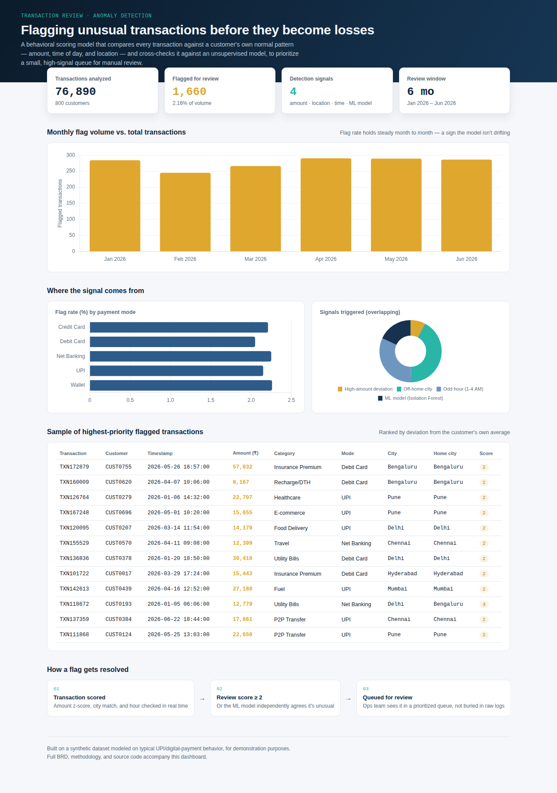

# Transaction Anomaly Review System

A behavioral anomaly detection system that flags unusual digital payment transactions for manual review — built end-to-end, starting from a formal Business Requirements Document through to a working detection model and dashboard.

## Business Problem

Digital payment platforms currently catch fraudulent or erroneous transactions **reactively** — usually only after a customer complaint or chargeback. This project builds a **proactive** review system: every transaction is checked against the customer's own normal behavior (typical amount, typical location, typical time) and flagged for review if it looks out of place.

Full requirements are documented in [`BRD_Transaction_Anomaly_Review.pdf`](./BRD_Transaction_Anomaly_Review.pdf).

## Approach

1. **Business Requirements Document** — defined the objective, stakeholders, business requirements (BR-1 to BR-6), and success metrics before writing any code.
2. **Data** — generated a realistic synthetic dataset (since real transaction data isn't publicly available): ~77,000 transactions across 800 customers over 6 months, with ~1,660 behaviorally unusual transactions injected for testing.
3. **Detection model** — combined:
   - Per-customer amount deviation (z-score against their own history)
   - Off-home-city flag
   - Odd-hour flag (1–4 AM)
   - An independent Isolation Forest (unsupervised ML) model as a cross-check
4. **Dashboard** — visualized results for a review team: monthly flag trends, flag rate by payment mode, signal breakdown, and a sample prioritized review queue.

## Key Results

| Metric | Value |
|---|---|
| Transactions analyzed | 76,890 |
| Customers | 800 |
| Flagged for review | 1,660 (2.16%) |
| Detection signals combined | 4 |

The flag rate stayed consistent month-over-month (~2.0–2.3%), which matters for a real review team — a low, stable rate keeps the queue actionable instead of overwhelming.

## Dashboard



Open [`dashboard.html`](./dashboard.html) directly (download and double-click, or view via GitHub Pages if enabled) to explore the interactive version.

## Project Structure

```
transaction-anomaly-review-system/
├── README.md
├── BRD_Transaction_Anomaly_Review.pdf
├── BRD_Transaction_Anomaly_Review.docx
├── generate_data.py
├── analysis.py
├── make_charts.py
├── dashboard.html
├── dashboard_screenshot.png
├── chart_monthly.png
├── chart_mode.png
└── chart_reasons.png
```

## How to Run

```bash
pip install pandas numpy scikit-learn matplotlib

python generate_data.py     # creates transactions.csv
python analysis.py          # scores transactions -> transactions_scored.csv
python make_charts.py       # generates chart PNGs
```

Open `dashboard.html` directly in a browser to view the interactive dashboard.

## Tech Stack

Python · Pandas · NumPy · Scikit-learn (Isolation Forest) · Matplotlib · HTML/CSS/JS (Chart.js) for the dashboard

## Author

**Rutuja Jadhav**
[LinkedIn](https://linkedin.com/in/rutuja-jadhav-592388321) · [GitHub](https://github.com/rj05-ux)
